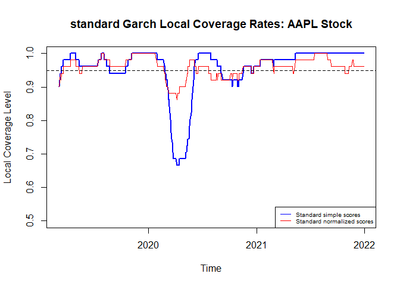
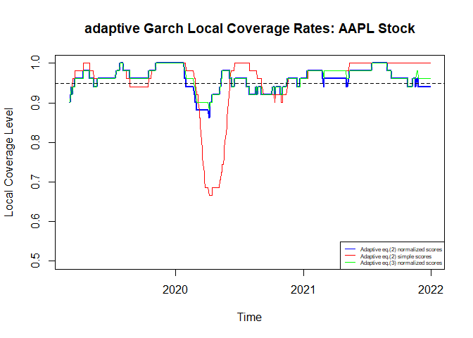
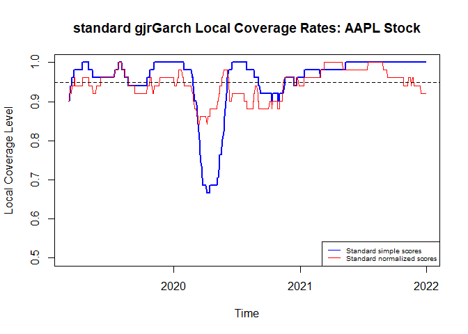
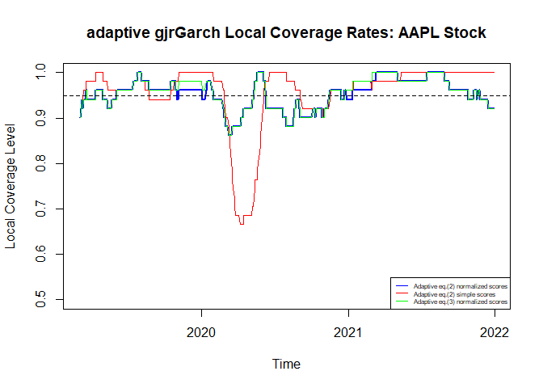
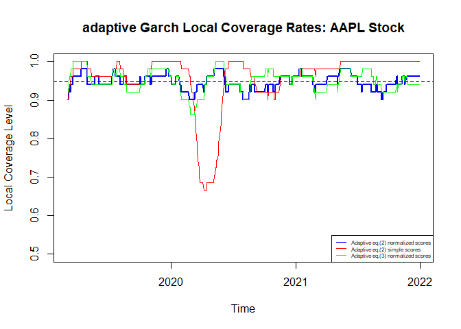
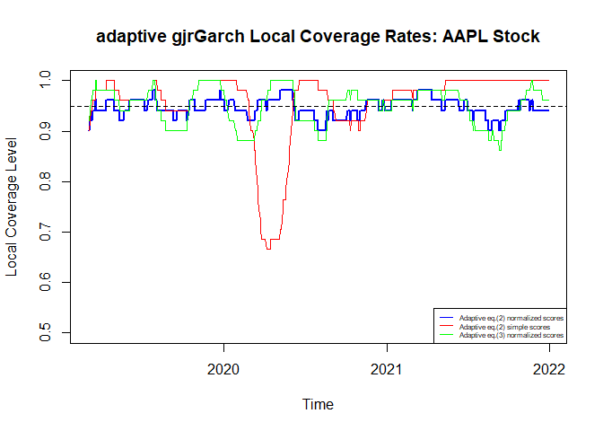
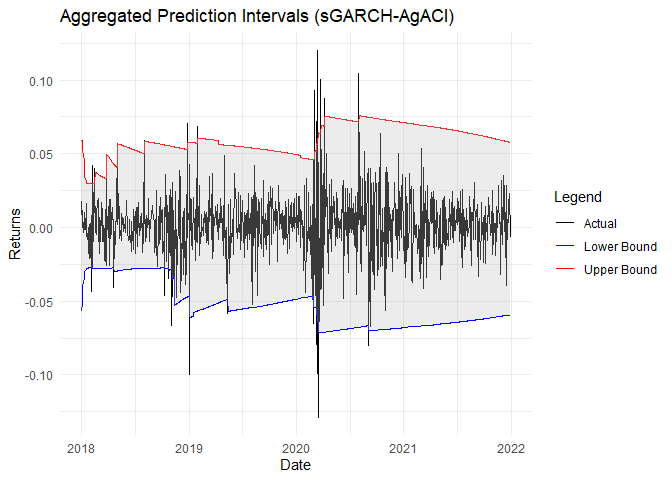
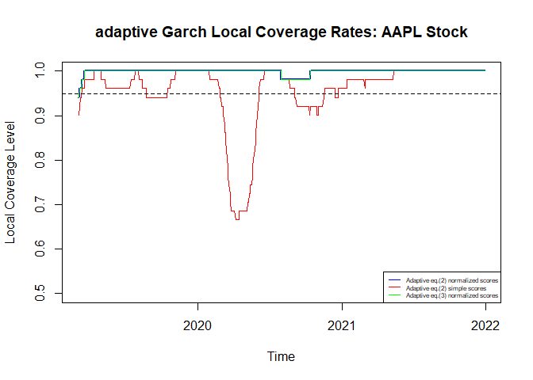

### TASK 1

**a.** Read the ACI paper (you shall focus on Section 1 and Section 2,
while only cover in passing Section 4– other sections can be ignored),
familiarize with their proposal and provide a formal description of
their work and method. The formal description should be mainly based on
Section 1.1 and Section 2 (excluding the application of Section 2.2
which will be tackled in the next point).

The main purpose of the paper is to develop a method for the
construction of prediction sets in a framework in which the marginal
distribution of the data is allowed to vary. A framework, therefore, in
which one of the main assumptions upon which Conformal Prediction is
based, namely the stationarity of the marginal distribution of the data
being analyzed and consequently its exchangeability, is not taken into
account.

In fact, the assumption of exchangeability clashes with many real-world
problems, where the generating function of the data tends to change
depending on multiple factors.

For this reason, Gibbs and Candès introduced and developed the ACI
(adaptive conformal inference) method, aimed at allowing the
construction of the prediction set when a change in the marginal
distribution of the data is expected.

Their approach is intended to be both:

- **Simple:** with the introduction of a single parameter that tracks
  the change in the marginal distribution;

- **General**: therefore, applicable to all those machine learning
  algorithms that have a point prediction or a quantile for the response
  variable as output.

In the case in which we can consider the marginal distribution of the
data to be stationary over time, given the observed covariate-response
pairs $${(X_t,Y_t)}$$ from a fitted model that predict the value of Y
form X, the Standard Conformal Prediction assign a conformity score to
the pair such as: $$S(X_t, Y_t)$$

The method’s main goal is to find the smallest comformity score \$S(X_t,
y) for which $y$, a possible prediction of $Y_t$, can be considered
reasoneable.

The method prevede che i dati vengano splittati e che, utilizzando un
insieme di calibrazioni di coppie (X_r, Y_r) osservate in passato (ma
non utilizzate per fittare il modello), si calcolino i quantili dei
punteggi di conformità:

$$\hat Q(p) : = \inf \left\{ s : \frac{1}{|D_{\text{cal}}|} \sum_{(X_r, Y_r) \in D_{\text{cal}}} \mathbf{1}(S(X_r, Y_r) \leq s) \geq p \right\}$$

The quantile identifies that threshold $s$ for which a certain
proportion $p$ of the conformity scores are smaller than the threshold
itself.

$$S(X_t, y) \leq \hat{Q}(1 - \alpha)$$

$y$ is considered a reasonable prediction, if the associated conformity
score falls within the $1-\alpha$ threshold of the observed scores in
the calibration set. Indeed, if the value of \$S(X_t,y) is below the
threshold $s$ it means that it is consistent with the past scores of the
other predictions of $Y_t$.

This allows the creation of the conformal prediction set as:

$$\hat{C}_t = \{ y : S(X_t, y) \leq \hat{Q}(1 - \alpha) \}$$ Knowing
that $D_{\text{cal}} \cup \{(X_t, Y_t)\}$ is exchangeble imply that the
set of the conformity score ${S(X_r,Y_r)}$ is uniform, meaning that
every of conformity score has the same probability to happen.

This condition grant that the prediction set’s coverage. So,that the on
an average level the real value of $Y_t$ will fall inside the prediction
set with a coverage level of $1-\alpha$.

Whenever we have a distribution of the data that tends to change over
time, it is necessary to adapt, throught a re-estimation, the score
function $S(.)$ and the quantile function $Q(.)$.

So, for each time $t$ we take in consideration, we have a different
$Q_t()$ and $S_t()$. As a consequence, even the realized miscoverage
rate of the prediction set $\hat C(\alpha)$ could vary over multiple
time periods $t$:

$$M_t(\alpha) = P(S_t(X_t, Y_t) > \hat Q_t(1 - \alpha))$$ so, there is a
chance the $M_t(\alpha)$ is not equal to $\alpha$. Per garantire la
copertura empirica di $1-\alpha$ we introduce a parameter $\alpha_t$,
che viene aggiornato iterativamente durante diversi periodi di tempo
$t$.

$$
\text{err}_t :=
\begin{cases}
1, & \text{if } Y_t \notin \hat{C}_t(\alpha_t), \\
0, & \text{otherwise},
\end{cases}
\quad \text{where } \hat{C}_t(\alpha_t) := \{y : S_t(X_t, y) \leq \hat{Q}_t(1 - \alpha_t)\}.
$$

On the basis of the miscoverage, $\alpha_t$ is adjusted by increasing
the estimation of the previous $\alpha_t$ or decreasing it, depending if
there was an under or over-covering.

The calibration of the parameter $\alpha_t$ can be performed in two
different ways:

1.  $$\alpha_{t+1}=\alpha_t+\gamma(\alpha-err_t)$$

- $\gamma$ is the step size parameter. It has to be greater than 0. By
  the choice of $\gamma$ depends the adaptability of the paratemeter
  $\alpha_t$. Greater value of $\gamma$ will make the method more
  adaptive to the change in the distribution, but tje calibration of
  $\alpha_t$ more volatile.

- $\alpha - err_t$, representing how much the empirical coverage
  deviates from the one we aim to obtain.

2.  $$\alpha_{t+1} = \alpha_t + \gamma \left(\alpha - \sum_{s=1}^t w_s \cdot \text{err}_s \right)$$
    In which the calibration of $\alpha_{t+1}$ take into account the
    most recent miscoverages.

In fact, ${w_s}$ is a sequence of increasing weight given to each
different $err_s$ over the $t$ period of time.

It can be proved that both cases, 1 and 2, produce similar results with
different trajectory taken by $\alpha_t$.

**b.** For this task we need to apply ACI to quantify the prediction
uncertainty of the volatility of a chosen asset. Focusing on two
modeling strategies, the GARCH(1,1) tackled in the paper and a more
sophisticated GARCH of your choice (e.g., with asymmetries or heavier
tails), evaluate and compare the following strategies:

1.  A **standard (non-adaptive) CP strategy** with both simple
    (non-normalized) and studentized or normalized absolute residual
    scores as reported in Section 5 of the ACI paper (and as implemented
    in Section 2.2);
2.  An **adaptive CP strategy** with both simple (non-normalized) and
    studentized or normalized absolute residual scores as reported in
    Section 5 of the ACI paper (and as implemented in Section 2.2) and
    with adaptation following the simple formula in Eq. (2) in Section
    2.2
3.  An **adaptive CP strategy** with studentized or normalized absolute
    residual scores as reported in Section 5 of the ACI paper (and as
    implemented in Section 2.2) and with adaptation following the
    alternative idea in Eq. (3) in Section 2.2

In order to perform the task, we will use the following packages:

``` r
library(quantmod)
library(stats)
library(quantreg)
library(rugarch)
library(ggplot2)
library(gridExtra)
library(dplyr)
library(opera)
```

We proceed downloading Apple’s historical stock data for the period from
January 2015 to December 2020 by using the function `"getSymbols"`.

``` r
getSymbols("AAPL", from = "2014-01-01", to = "2021-12-31")
```

    ## [1] "AAPL"

``` r
sp500 <- Cl(AAPL)
returns <- dailyReturn(sp500)
returns <- na.omit(returns)
length(returns)
```

    ## [1] 2014

After extracting all closing prices of the stock for the period under
consideration, we calculate the daily returns using the `'dailyReturn'`
function, which considers the percentage difference of closing prices
for two adjacent days. Subsequently, any missing values are eliminated
using `'na.omit'`.

Now we proceed with the structuring of the function to perform the
standard and adaptive conformal prediction first for the GARCH(1,1)
model using both simple and normalized residual scores. Then we do the
same for the gjr GARCH model to see the differences. We’ve decided to
use this model for the comparison because it takes into consideration
the asymmetries in the variance.

We create a function to perform standard and adaptive conformal
prediction with different scoring methods, leveraging the GARCH model
and the gjr to quantify volatility and calculate residual scores.

To define the functions we have used as **input parameters**:

- $\alpha$: significance level for prediction intervals;

- *lookback*: past observation of the asset to fit the model;

- *garchp* and *garchq*: the GARCH model orders;

- *startup*: the minimum number of observations before the prediction
  starts;

- *verbose*: used to control the level of output or messages displayed
  during the execution of the function;

- $\gamma$: step size for updating $\alpha_t$ adaptively;

- *updateMethod* : method for updating $\alpha_t$ (“Simple” or
  “Momentum”);

- *momentumBW* : exponential decay factor for momentum-based weighting;

- *modeltype* : to specify which model we are taking into consideration
  for the CP.

Here we’ve used an if statement which allowed us to execute a block of
code among more alternatives which in this case are the type of models.
Then, based on the type of model contained in the if statemnt, we
proceed with the ‘ugarchspec’ to define the latter. In the case of
standard GARCH we use the identification ‘sGARCH’. In the case of gjr
GARCH we use the identification ‘gjrGARCH’.

We’ve created some empty lists to store, after the main loop is
performed, the results for alpha, the errors ‘errSeqOC’ and ‘errSeqNC’
and the scores. We have two sequence of errors because we want to
address for both the fixed and adaptive $\alpha$.

``` r
garchConformalForcasting <- function(returns, alpha = 0.05, gamma = 0.001, lookback = 1250, garchP = 1, garchQ = 1, startUp = 100, verbose = FALSE, updateMethod = "Standard", momentumBW = 0.95, modelType = "sGARCH") {
  myT <- length(returns)
  T0 <- max(startUp, lookback)
  if (modelType == "sGARCH") {
    garchSpec <- ugarchspec(
      mean.model = list(armaOrder = c(0, 0), include.mean = FALSE),
      variance.model = list(model = "sGARCH", garchOrder = c(garchP, garchQ)),
      distribution.model = "norm"
    )
  } else if (modelType == "gjrGARCH") {
    garchSpec <- ugarchspec(
      mean.model = list(armaOrder = c(0, 0), include.mean = FALSE),
      variance.model = list(model = "gjrGARCH", garchOrder = c(garchP, garchQ)),
      distribution.model = "norm"
    )
  } 
  
  
  alphat <- alpha
  # Initialize data storage variables
  errSeqOC <- rep(0, myT - T0 + 1)
  errSeqNC <- rep(0, myT - T0 + 1)
  alphaSequence <- rep(alpha, myT - T0 + 1)
  scores_normalized <- rep(0, myT - T0 + 1)
  scores_simple <- rep(0, myT - T0 + 1)
  # Main loop
  for (t in T0:myT) {
    if (verbose) {
      print(t)
    }
    
    # Fit GARCH model and forecast next variance
    garchFit <- ugarchfit(garchSpec, returns[(t - lookback + 1):(t - 1)], solver = "hybrid")
    sigmaNext <- sigma(ugarchforecast(garchFit, n.ahead = 1))
    
    # Compute conformity scores
    scores_normalized[t - T0 + 1] <- abs(returns[t]^2 - sigmaNext^2) / sigmaNext^2
    scores_simple[t - T0 + 1] <- abs(returns[t]^2 - sigmaNext^2)
    
    # Recent scores for the lookback period
    recentScores_normalized <- scores_normalized[max(t - T0 + 1 - lookback + 1, 1):(t - T0)]
    recentScores_simple <- scores_simple[max(t - T0 + 1 - lookback + 1, 1):(t - T0)]
    
    # Compute errors for both scoring methods
    errSeqOC[t - T0 + 1] <- as.numeric(scores_normalized[t - T0 + 1] > quantile(recentScores_normalized, 1 - alphat))
    errSeqNC[t - T0 + 1] <- as.numeric(scores_simple[t - T0 + 1] > quantile(recentScores_simple, 1 - alpha))
    # Update alpha for adaptive methods
    alphaSequence[t - T0 + 1] <- alphat
    if (updateMethod == "Simple") {
      alphat <- alphat + gamma * (alpha - errSeqOC[t - T0 + 1])
      alphat <- max(0, min(1, alphat)) 
    } else if (updateMethod == "Momentum") {
      w <- rev(momentumBW^(1:(t - T0 + 1)))
      w <- w / sum(w)
      alphat <- alphat + gamma * (alpha - sum(errSeqOC[1:(t - T0 + 1)] * w))
      alphat <- max(0, min(1, alphat)) 
    }
    
    
    # Keep alpha fixed for the "Standard" method
    if (updateMethod == "Standard") {
      alphat <- alpha
    }
    
    
    if (t %% 100 == 0 && verbose) {
      print(sprintf("Done %g steps", t))
    }
  }
  
  return(list(alphaSequence = alphaSequence, errSeqOC = errSeqOC, errSeqNC = errSeqNC))
}
```

For the main part of the process we’ve computed a for loop, we iterated
from T0 to myT to make predictions using ‘ugarchfit’ to model the past
lookback returns and forecast the next period’s volatility. The
algorithm compares each score to the empirical quantile of recent scores
to compute the conformity error, which indicates whether the new return
lies outside the conformal prediction interval. To achieve that we use
both normalized and simple absolute residuals score. Finally, We compute
the errors using quantiles, errSeqOC(Online conformal) which takes into
consideration the current $\alpha_t$ and errSeqNC(Non-conformal) which
takes into consideration the fixed $\alpha$. The first one refers to the
normalized residual scores and the second one to the simple absolute
residual scores. These two error sequence are important to detect
whether the model predicts well in both cases and to compare the
different strategies.

We updated $\alpha_t$ using the simple or the momentum method:

The **Simple Method** directly adjusts $\alpha_t$ proportional to the
deviation of observed errors from the target significance level
($\alpha$). The update equation is:

$$
\alpha_{t+1} = \alpha_t + \gamma (\alpha - \text{errSeqOC}_t)
$$

The **Momentum Method** applies an **exponentially weighted moving
average (EWMA)** to the observed errors, providing smoother updates. The
update equation is:

$$
\alpha_{t+1} = \alpha_t + \gamma \left(\alpha - \sum w_i \cdot \text{errSeqOC}_i \right)
$$

Finally, we specify that if the ‘updateMethod’ is standard we want the
function to use a fixed $alpha$. Before computing the results we create
a function to measure the performance of these method using their local
coverage frequencies following this formula: $$
\text{localCov}_{t} := 1 - \frac{1}{500} \sum_{r = t - 250 + 1}^{t + 250} \text{err}_r
$$ We’ve computed a rolling avarage over a specified window size. The
function will calculate the average over the most recent 50 values for
each step in the vector. Specifically, it will take the slice of errors
from (t - window_size + 1) to t and then computes the mean of the
elements in this window. The command ‘sapply’ applies the function for
each t in the range and returns a vector of the rolling averages.

``` r
window_size <- 50
compute_coverage <- function(errors, window_size) {
  n <- length(errors)
  half_window <- window_size / 2
  sapply((half_window + 1):(n - half_window), function(t) {
    local_mean <- mean(errors[(t - half_window):(t + half_window)])
    1 - local_mean  # Local coverage frequency
  })
}
```

Now we apply the functions we’ve constructed to our data and analyse the
results. To do that we’ve plotted the local frequencies for the fixed
$\alpha$ and the adaptive $\alpha$.

``` r
### Result for the standard conformal prediction of GARCH

results_simple_residuals <- garchConformalForcasting(returns = returns, alpha = 0.05, gamma = 0.001,lookback=1250,garchP=1,garchQ=1,startUp = 100,verbose=FALSE,updateMethod="Standard", modelType = "sGARCH")
date_ <- index(sp500)[1750:length(index(sp500))]
alphaSequence <- results_simple_residuals$alphaSequence
errSeqOC <- results_simple_residuals$errSeqOC
errSeqNC <- results_simple_residuals$errSeqNC
mean_errSeqOC <- mean(errSeqOC)
mean_errSeqNC <- mean(errSeqNC)
print(mean_errSeqOC)
```

    ## [1] 0.04313725

``` r
print(mean_errSeqNC)
```

    ## [1] 0.04575163

``` r
st_simple_local_cov <- compute_coverage(errSeqNC, window_size)
st_normal_local_cov <- compute_coverage(errSeqOC, window_size)

### Result for the standard conformal prediction of GJR GARCH

results_simple_residuals_GJR <- garchConformalForcasting(returns = returns, alpha = 0.05, gamma = 0.001,lookback=1250,garchP=1,garchQ=1,startUp = 100,verbose=FALSE,updateMethod="Standard", modelType = "gjrGARCH")
date_ <- index(sp500)[1250:length(index(sp500))]
alphaSequence <- results_simple_residuals_GJR$alphaSequence
errSeqOC_GJR <- results_simple_residuals_GJR$errSeqOC
errSeqNC_GJR <- results_simple_residuals_GJR$errSeqNC
mean_errSeqOC_GJR <- mean(errSeqOC_GJR)
mean_errSeqNC_GJR <- mean(errSeqNC_GJR)
print(mean_errSeqOC_GJR)
```

    ## [1] 0.05882353

``` r
print(mean_errSeqNC_GJR)
```

    ## [1] 0.04575163

``` r
stGJR_simple_local_cov <- compute_coverage(errSeqNC_GJR, window_size)
stGJR_normal_local_cov <- compute_coverage(errSeqOC_GJR, window_size)

### Result for the adaptive strategy using EQ.2

results_EQ2 <- garchConformalForcasting(returns = returns, alpha = 0.05, gamma = 0.001,lookback=1250,garchP=1,garchQ=1,startUp = 100,verbose=FALSE,updateMethod="Simple", modelType = "sGARCH")
date_EQ2 <- index(sp500)[1250:length(index(sp500))]
alphaSequence_EQ2 <- results_EQ2$alphaSequence
errSeqOC_EQ2 <- results_EQ2$errSeqOC
errSeqNC_EQ2 <- results_EQ2$errSeqNC
mean_errSeqOC_EQ2 <- mean(errSeqOC_EQ2)
mean_errSeqNC_EQ2 <- mean(errSeqNC_EQ2)
print(mean_errSeqOC_EQ2)
```

    ## [1] 0.04444444

``` r
print(mean_errSeqNC_EQ2)
```

    ## [1] 0.04575163

``` r
adGARCH2_simple_loccov <- compute_coverage(errSeqNC_EQ2, window_size)
adGARCH2_normal_loccov <- compute_coverage(errSeqOC_EQ2, window_size)

### Result for the adaptive strategy using EQ.3

results_EQ3 <- garchConformalForcasting(returns = returns, alpha = 0.05, gamma = 0.001,lookback=1250,garchP=1,garchQ=1,startUp = 100,verbose=FALSE,updateMethod="Momentum", momentumBW = 0.95, modelType = "sGARCH")
date_EQ3 <- index(sp500)[1250:length(index(sp500))]
alphaSequence_EQ3 <- results_EQ3$alphaSequence
errSeqOC_EQ3 <- results_EQ3$errSeqOC
errSeqNC_EQ3 <- results_EQ3$errSeqNC
mean_errSeqOC_EQ3 <- mean(errSeqOC_EQ3)
mean_errSeqNC_EQ3 <- mean(errSeqNC_EQ3)
print(mean_errSeqOC_EQ3)
```

    ## [1] 0.04052288

``` r
print(mean_errSeqNC_EQ3)
```

    ## [1] 0.04575163

``` r
adGARCH3_simple_loccov <- compute_coverage(errSeqNC_EQ3, window_size)
adGARCH3_normal_loccov <- compute_coverage(errSeqOC_EQ3, window_size)


### Result for the adaptive strategy using EQ.2 for the gjr GARCH

results_EQ2_gjr <- garchConformalForcasting(returns = returns, alpha = 0.05, gamma = 0.001,lookback=1250,garchP=1,garchQ=1,startUp = 100,verbose=FALSE,updateMethod="Simple", modelType = "gjrGARCH")
date_EQ2 <- index(sp500)[1250:length(index(sp500))]
alphaSequence_EQ2 <- results_EQ2_gjr$alphaSequence
errSeqOC_EQ2 <- results_EQ2_gjr$errSeqOC
errSeqNC_EQ2 <- results_EQ2_gjr$errSeqNC
mean_errSeqOC_EQ2 <- mean(errSeqOC_EQ2)
mean_errSeqNC_EQ2 <- mean(errSeqNC_EQ2)
print(mean_errSeqOC_EQ2)
```

    ## [1] 0.05228758

``` r
print(mean_errSeqNC_EQ2)
```

    ## [1] 0.04575163

``` r
adGJR2_simple_loccov <- compute_coverage(errSeqNC_EQ2, window_size)
adGJR2_normal_loccov <- compute_coverage(errSeqOC_EQ2, window_size)


### Result for the adaptive strategy using EQ.3 for the gjr GARCH 

results_EQ3_gjr <- garchConformalForcasting(returns = returns, alpha = 0.05, gamma = 0.001,lookback=1250,garchP=1,garchQ=1,startUp = 100,verbose=FALSE,updateMethod="Momentum", momentumBW = 0.95, modelType = "gjrGARCH")
date_EQ3 <- index(sp500)[1250:length(index(sp500))]
alphaSequence_EQ3 <- results_EQ3_gjr$alphaSequence
errSeqOC_EQ3 <- results_EQ3_gjr$errSeqOC
errSeqNC_EQ3 <- results_EQ3_gjr$errSeqNC
mean_errSeqOC_EQ3 <- mean(errSeqOC_EQ3)
mean_errSeqNC_EQ3 <- mean(errSeqNC_EQ3)
print(mean_errSeqOC_EQ3)
```

    ## [1] 0.0496732

``` r
print(mean_errSeqNC_EQ3)
```

    ## [1] 0.04575163

``` r
adGJR3_simple_loccov <- compute_coverage(errSeqNC_EQ3, window_size)
adGJR3_normal_local_cov <- compute_coverage(errSeqOC_EQ3, window_size)

# Plot results
time <-  index(sp500)[(window_size + 1250):length(sp500)]
plot(time, st_simple_local_cov, type = "l", col = "blue",lwd = 2,
     main = "standard Garch Local Coverage Rates: AAPL Stock", xlab = "Time", ylab = "Local Coverage Level", ylim = c(0.5,1))
lines(time, st_normal_local_cov, col = "red")
abline(h = 0.95, col = "black", lty = 2)  # Target coverage level
legend("bottomright", legend = c("Standard simple scores","Standard normalized scores"),
                                 col = c("blue","red"), lty = 1,cex=0.6)
```


``` r
plot(time, adGARCH2_normal_loccov, type = "l", col = "blue",lwd = 2,
     main = "adaptive Garch Local Coverage Rates: AAPL Stock", xlab = "Time", ylab = "Local Coverage Level", ylim = c(0.5,1))
lines(time, adGARCH2_simple_loccov, col = "red")
lines(time,adGARCH3_normal_loccov,col="green")
abline(h = 0.95, col = "black", lty = 2)  # Target coverage level
legend("bottomright", legend = c("Adaptive eq.(2) normalized scores","Adaptive eq.(2) simple scores","Adaptive eq.(3) normalized scores"), 
       col = c("blue", "red","green"), lty = 1,cex=0.5)
```


``` r
plot(time, stGJR_simple_local_cov, type = "l", col = "blue",lwd = 2,
     main = "standard gjrGarch Local Coverage Rates: AAPL Stock", xlab = "Time", ylab = "Local Coverage Level", ylim = c(0.5,1))
lines(time, stGJR_normal_local_cov, col = "red")
abline(h = 0.95, col = "black", lty = 2)  # Target coverage level
legend("bottomright", legend = c("Standard simple scores","Standard normalized scores"),
                                 col = c("blue","red"), lty = 1,cex=0.6)
```



``` r
plot(time, adGJR2_normal_loccov, type = "l", col = "blue",lwd = 2,
     main = "adaptive gjrGarch Local Coverage Rates: AAPL Stock", xlab = "Time", ylab = "Local Coverage Level", ylim = c(0.5,1))
lines(time, adGJR2_simple_loccov, col = "red")
lines(time,adGJR3_normal_local_cov,col="green")
abline(h = 0.95, col = "black", lty = 2)  # Target coverage level
legend("bottomright", legend = c("Adaptive eq.(2) normalized scores","Adaptive eq.(2) simple scores","Adaptive eq.(3) normalized scores"), 
       col = c("blue", "red","green"), lty = 1,cex=0.5)
```



To better understand the behaviour of alpha and the differences between
the various updating method and their error we have plotted the
‘errSeqNC’ VS the ‘errSeqOC’ for each strategy. On the X-axis of the
plot we have the time, on the Y-axis we have the local coverage
frequencies which we have computed before. he Y-axis represents the
proportion of time periods where the actual stock returns fall within
the predicted volatility range. A higher coverage rate indicates better
model performance.

In the first half of all plots we can see that there are some
discrepancies within the different methods showing a high local coverage
rate initially, followed by a sharp decline around 2020. This may be
attributed to heightened market volatility (possibly linked to the
COVID-19 pandemic’s onset), demonstrating the challenge of maintaining
accurate prediction intervals in turbulent markets. After mid-2020, the
coverage levels stabilize somewhat, but discrepancies between different
methods become more apparent. Specifically, we can see that the
strategies adopting normalized residual scores tend to fluctuate around
the target coverage level (95%) and present a constant trend while the
strategies adopting simple residuals score deviate from the target level
more often.

The adaptive methods seem to sligthly diverge from the standard methods
by offering potentially better local adjustments during periods of
market instability. Additionally there aren’t many differences between
the adaptive methods Simple and Momentum but those assuming normalized
scores tend to perform better.

**In our case**, we can conclude there aren’t huge differences between
the various strategy and between the two types of GARCH chosen. Looking
at the plots we can confirm the better performance of strategies
applying normalized residual scores (both standard and adaptive). The
conformal prediction methods shows a slightly greater error for the gjr
than for the standard GARCH.

Now we do the same but changing the adaptation rate $\gamma$ and setting
it to 0.05.

``` r
### Result for the standard conformal prediction of GARCH

results_simple_residuals <- garchConformalForcasting(returns = returns, alpha = 0.05, gamma = 0.05,lookback=1250,garchP=1,garchQ=1,startUp = 100,verbose=FALSE,updateMethod="Standard", modelType = "sGARCH")
date_ <- index(sp500)[1750:length(index(sp500))]
alphaSequence <- results_simple_residuals$alphaSequence
errSeqOC <- results_simple_residuals$errSeqOC
errSeqNC <- results_simple_residuals$errSeqNC
mean_errSeqOC <- mean(errSeqOC)
mean_errSeqNC <- mean(errSeqNC)
print(mean_errSeqOC)
```

    ## [1] 0.04313725

``` r
print(mean_errSeqNC)
```

    ## [1] 0.04575163

``` r
st_simple_local_cov <- compute_coverage(errSeqNC, window_size)
st_normal_local_cov <- compute_coverage(errSeqOC, window_size)

### Result for the standard conformal prediction of GJR GARCH

results_simple_residuals_GJR <- garchConformalForcasting(returns = returns, alpha = 0.05, gamma = 0.05,lookback=1250,garchP=1,garchQ=1,startUp = 100,verbose=FALSE,updateMethod="Standard", modelType = "gjrGARCH")
date_ <- index(sp500)[1250:length(index(sp500))]
alphaSequence <- results_simple_residuals_GJR$alphaSequence
errSeqOC_GJR <- results_simple_residuals_GJR$errSeqOC
errSeqNC_GJR <- results_simple_residuals_GJR$errSeqNC
mean_errSeqOC_GJR <- mean(errSeqOC_GJR)
mean_errSeqNC_GJR <- mean(errSeqNC_GJR)
print(mean_errSeqOC_GJR)
```

    ## [1] 0.05882353

``` r
print(mean_errSeqNC_GJR)
```

    ## [1] 0.04575163

``` r
stGJR_simple_local_cov <- compute_coverage(errSeqNC_GJR, window_size)
stGJR_normal_local_cov <- compute_coverage(errSeqOC_GJR, window_size)

### Result for the adaptive strategy using EQ.2

results_EQ2 <- garchConformalForcasting(returns = returns, alpha = 0.05, gamma = 0.05,lookback=1250,garchP=1,garchQ=1,startUp = 100,verbose=FALSE,updateMethod="Simple", modelType = "sGARCH")
date_EQ2 <- index(sp500)[1250:length(index(sp500))]
alphaSequence_EQ2 <- results_EQ2$alphaSequence
errSeqOC_EQ2 <- results_EQ2$errSeqOC
errSeqNC_EQ2 <- results_EQ2$errSeqNC
mean_errSeqOC_EQ2 <- mean(errSeqOC_EQ2)
mean_errSeqNC_EQ2 <- mean(errSeqNC_EQ2)
print(mean_errSeqOC_EQ2)
```

    ## [1] 0.05490196

``` r
print(mean_errSeqNC_EQ2)
```

    ## [1] 0.04575163

``` r
adGARCH2_simple_loccov <- compute_coverage(errSeqNC_EQ2, window_size)
adGARCH2_normal_loccov <- compute_coverage(errSeqOC_EQ2, window_size)

### Result for the adaptive strategy using EQ.3

results_EQ3 <- garchConformalForcasting(returns = returns, alpha = 0.05, gamma = 0.05,lookback=1250,garchP=1,garchQ=1,startUp = 100,verbose=FALSE,updateMethod="Momentum", momentumBW = 0.95, modelType = "sGARCH")
date_EQ3 <- index(sp500)[1250:length(index(sp500))]
alphaSequence_EQ3 <- results_EQ3$alphaSequence
errSeqOC_EQ3 <- results_EQ3$errSeqOC
errSeqNC_EQ3 <- results_EQ3$errSeqNC
mean_errSeqOC_EQ3 <- mean(errSeqOC_EQ3)
mean_errSeqNC_EQ3 <- mean(errSeqNC_EQ3)
print(mean_errSeqOC_EQ3)
```

    ## [1] 0.05228758

``` r
print(mean_errSeqNC_EQ3)
```

    ## [1] 0.04575163

``` r
adGARCH3_simple_loccov <- compute_coverage(errSeqNC_EQ3, window_size)
adGARCH3_normal_loccov <- compute_coverage(errSeqOC_EQ3, window_size)


### Result for the adaptive strategy using EQ.2 for the gjr GARCH

results_EQ2_gjr <- garchConformalForcasting(returns = returns, alpha = 0.05, gamma = 0.05,lookback=1250,garchP=1,garchQ=1,startUp = 100,verbose=FALSE,updateMethod="Simple", modelType = "gjrGARCH")
date_EQ2 <- index(sp500)[1250:length(index(sp500))]
alphaSequence_EQ2 <- results_EQ2_gjr$alphaSequence
errSeqOC_EQ2 <- results_EQ2_gjr$errSeqOC
errSeqNC_EQ2 <- results_EQ2_gjr$errSeqNC
mean_errSeqOC_EQ2 <- mean(errSeqOC_EQ2)
mean_errSeqNC_EQ2 <- mean(errSeqNC_EQ2)
print(mean_errSeqOC_EQ2)
```

    ## [1] 0.05620915

``` r
print(mean_errSeqNC_EQ2)
```

    ## [1] 0.04575163

``` r
adGJR2_simple_loccov <- compute_coverage(errSeqNC_EQ2, window_size)
adGJR2_normal_loccov <- compute_coverage(errSeqOC_EQ2, window_size)


### Result for the adaptive strategy using EQ.3 for the gjr GARCH 

results_EQ3_gjr <- garchConformalForcasting(returns = returns, alpha = 0.05, gamma = 0.05,lookback=1250,garchP=1,garchQ=1,startUp = 100,verbose=FALSE,updateMethod="Momentum", momentumBW = 0.95, modelType = "gjrGARCH")
date_EQ3 <- index(sp500)[1250:length(index(sp500))]
alphaSequence_EQ3 <- results_EQ3_gjr$alphaSequence
errSeqOC_EQ3 <- results_EQ3_gjr$errSeqOC
errSeqNC_EQ3 <- results_EQ3_gjr$errSeqNC
mean_errSeqOC_EQ3 <- mean(errSeqOC_EQ3)
mean_errSeqNC_EQ3 <- mean(errSeqNC_EQ3)
print(mean_errSeqOC_EQ3)
```

    ## [1] 0.05228758

``` r
print(mean_errSeqNC_EQ3)
```

    ## [1] 0.04575163

``` r
adGJR3_simple_loccov <- compute_coverage(errSeqNC_EQ3, window_size)
adGJR3_normal_local_cov <- compute_coverage(errSeqOC_EQ3, window_size)

# Plot results
time <-  index(sp500)[(window_size + 1250):length(sp500)]
plot(time, st_simple_local_cov, type = "l", col = "blue",lwd = 2,
     main = "standard Garch Local Coverage Rates: AAPL Stock", xlab = "Time", ylab = "Local Coverage Level", ylim = c(0.5,1))
lines(time, st_normal_local_cov, col = "red")
abline(h = 0.95, col = "black", lty = 2)  # Target coverage level
legend("bottomright", legend = c("Standard simple scores","Standard normalized scores"),
                                 col = c("blue","red"), lty = 1,cex=0.6)
```


``` r
plot(time, adGARCH2_normal_loccov, type = "l", col = "blue",lwd = 2,
     main = "adaptive Garch Local Coverage Rates: AAPL Stock", xlab = "Time", ylab = "Local Coverage Level", ylim = c(0.5,1))
lines(time, adGARCH2_simple_loccov, col = "red")
lines(time,adGARCH3_normal_loccov,col="green")
abline(h = 0.95, col = "black", lty = 2)  # Target coverage level
legend("bottomright", legend = c("Adaptive eq.(2) normalized scores","Adaptive eq.(2) simple scores","Adaptive eq.(3) normalized scores"), 
       col = c("blue", "red","green"), lty = 1,cex=0.5)
```



``` r
plot(time, stGJR_simple_local_cov, type = "l", col = "blue",lwd = 2,
     main = "standard gjrGarch Local Coverage Rates: AAPL Stock", xlab = "Time", ylab = "Local Coverage Level", ylim = c(0.5,1))
lines(time, stGJR_normal_local_cov, col = "red")
abline(h = 0.95, col = "black", lty = 2)  # Target coverage level
legend("bottomright", legend = c("Standard simple scores","Standard normalized scores"),
                                 col = c("blue","red"), lty = 1,cex=0.6)
```


``` r
plot(time, adGJR2_normal_loccov, type = "l", col = "blue",lwd = 2,
     main = "adaptive gjrGarch Local Coverage Rates: AAPL Stock", xlab = "Time", ylab = "Local Coverage Level", ylim = c(0.5,1))
lines(time, adGJR2_simple_loccov, col = "red")
lines(time,adGJR3_normal_local_cov,col="green")
abline(h = 0.95, col = "black", lty = 2)  # Target coverage level
legend("bottomright", legend = c("Adaptive eq.(2) normalized scores","Adaptive eq.(2) simple scores","Adaptive eq.(3) normalized scores"), 
       col = c("blue", "red","green"), lty = 1,cex=0.5)
```



From the plots and the mean of the error sequences we could see that
this latter is greater if we choose a higher $\gamma$ value. The
standard conformal prediction results remain unchanged but for the
adaptive strategies the errors seem to be effected more by the influence
of $\gamma$ due to their adaptive structure. In particular we can see
that there is an increasing trend for the errors concerning the simple
adaptive strategies adopting normalized residuals for both the standard
GARCH and gjrGARCH. This behavior is confirmed also for the errors
concerning the momentum adaptive strategies using normalized residual
scores. In this case the gjr GARCH tends to perform slightly better than
the standard one.

This pattern of $\gamma$ could make the model more adaptive to market
changes but at the same time could introduce grater volatility in the
value of $\alpha$.

### CONCLUSION

The adaptive conformal prediction can be useful in regimes where the
data distribution changes frequently, but it may also lead to higher
noise or instability in the coverage rate behaviour.

### TASK 2

> a\. Read the AgACI paper (you can start with Section 2, which is more
> a synthesis of the original ACI paper and then focus on Section 4,
> which introduces the AgACI method), familiarize with their proposal
> and provide a formal description of their approach.

The AgACI method is an extension of the Adaptive Conformal Inference
(ACI), in which the results of several experts (each with a $\gamma$
value) are aggregated using an aggregation rule $\Phi$.

In fact, since it is not possible to identify a unique optimal value for
$\gamma$ , as this depends both on the structure of the data and on any
temporal dependencies that may vary over time, the AgACI method proposes
to calculate the ACI for a grid of K-values of $\gamma$ and then
aggregate the different predictions generated by K- expert (the K-ACI
algorithm with parameter $\gamma_k$) to obtain a single, aggregated,
prediction interval.

The algorithm involves the definition of $\alpha$, the so called
miscoverage rate. Later $\alpha$ is used to construct the pinball loss
function $\rho_\beta$.

This function restores the value of the accuracy of a quantile
forecasting model.

In particular, the function parameter $\beta$ is chosen as:

- $\frac{\alpha}{2}\$ : for the lower bound of the prediction
  interval$\_{t,k};\$

- $1-\frac{\alpha}{2}$ for the upper bound of prediction interval
  $\widehat{C}\alpha_{t,k}$.

Secondly, the algorithm proceeds to calculate for each $t$, the
prediction interval associated with the experts $k \in [1, K]$ (the grid
of $K$-values of $\gamma$ chosen):

$$\widehat{C}\alpha_{t,k}(\cdot) = \left[ \hat{b}^{(\ell)}_{t,k}(\cdot), \hat{b}^{(u)}_{t,k}(\cdot) \right]$$

If the upper or lower bound of the calculated interval does not belong
to the set $R$, it is necessary to set it equal to a threshold value:

$$\text{if } \hat{b}^{(\cdot)}_{t,k}(x_t) \notin R \quad \text{then set } \hat{b}^{(\cdot)}_{t,k}(x_t) = M^{(\cdot)}$$
In general, the method sets two threshold values $(M_\ell, M_u)$, as the
aggregation rule requires the experts to be bounded.

For each time $t$, the algorithm proceeds with the aggregation, on the
basis of a previously defined aggregation rule $\Phi$, of the upper and
lower bounds belonging to the computed $k$-prediction interval, to
obtain the aggregated output at time $t$:

$$\tilde{C}_t(x_t) = \left[ \tilde{b}^{(\ell)}_t(x_t), \tilde{b}^{(u)}_t(x_t) \right]$$
For each $k$-bound at time $t$, the pinball loss function with
parameters $\beta_\ell$ and $\beta_u$ calculates the suffered loss (how
much the target was overpredicted or underpredicted), which permits us
to associate a new weight to each bound:

$$w^{(\ell)}_{t,k} \quad \text{and} \quad w^{(u)}_{t,k}$$

The aggregation function then computes the optimal weighted mean of the
experts using the weights associated with each $k$-expert:

$$
\tilde{b}^{(\cdot)}_{t+1}(x) = \frac{\sum_{k=1}^K \omega^{(\cdot)}_{t,k} \hat{b}^{(\cdot)}_{t+1,k}(x)}{\sum_{l=1}^K \omega^{(\cdot)}_{t,l}}, \quad \forall x \in \mathbb{R}^d.
$$

In the end, what the algorithm obtains is an optimal prediction interval
based on the experts used, with the updated bounds that are dynamically
aggregated by considering, at each time $t$ the updated weight.

> 2.  Using the same financial asset chosen in Part I, apply AgACI to
>     quantify the prediction uncertainty of its volatility and evaluate
>     its covergare over time. Focus on the better performing GARCH
>     modeling strategy in Part I.
>
> - TheAgACI involves some new elements compared to the original ACI
>   and, in principle, it is not based on a volatility model but rather
>   a (quantile) regression model. Discuss how would you use your GARCH
>   model here, instead of the quantile regression; or, if you prefer
>   the other way around, how would you use a quantile regression,
>   rather than a GARCH model. Both options are fine, but you shall
>   focus on one, so stick to one and work on it.

Since we are analysing financial data, the GARCH model presents multiple
advantages compared to a quantile regression:

- It captures the tendencies of volatility to manifest through clusters,
  with periods of high and low volatility that alternate over time
  (*volatility clustering*);

- It captures the existence of different variances between different
  subsets of the same series, particularly if it is conditional (
  correlated with the previous set). A quantile regression could
  overlook this phenomenon (called *conditional heteroschedasticity*)

Furthermore, GARCH can be considered a flexible and adaptive model. Some
of its extension, such as EGARCH, due to its heavy tail can easily
capture asymmetric volatility shocks.

The AgACI method consist in combining K-experts, each associated with a
different fit parameter $\gamma_k$ from a grid of chosen value.

In the GARCH case, the K-expert is formulated as a GARCH(p,q):

$$\begin{equation}
\sigma_{t|t-1}^2 = \omega + \sum_{i=1}^p \alpha_{i} \epsilon_{t-i}^2 + \sum_{j=1}^q \beta_{j} \sigma_{t-j}^2.
\end{equation}$$

For each k-expert, the corresponding set of predictions is calculated
using the $\hat{\sigma}^2_{t+1,k}$ and the conformity score \$S\_{t,k}:

$$\begin{equation}
\widehat C_{t,k} = \left[ \hat{\sigma}^2_{t+1,k} - Q_{t,k}(1 - \alpha), \hat{\sigma}^2_{t+1,k} + Q_{t,k}(1 - \alpha) \right],
\end{equation}$$

When the aforementioned values of $\sigma^2$ not belong to $R$, it will
be necessary to impute a threshold value ($M($)) to the lower and/or
upper bound. However, if the stability conditions of the model are
fullfilled, the risk of non-real values is considerably reduced.

$$w>0, \ \ \alpha_i \geq0, \ \ \beta_j \geq 0,\ \ \sum{}(\alpha_i+\beta_j) <1$$

On the basis of a chosen rule of aggregation (which we’ll be defined
later), the lower and upper bound of each perdictions interval are
dynamically aggregated.

In fact, given the k-expert predictions generated the agACI assigns the
experts for each time $t$ a weight $w_{t,k}$ according to the suffered
loss.

To the k-experts that generated a lower suffered loss will be assigned a
higher weight.

The adaptive aggregated conformal inference method uses an ensemble
approach to combine the predictions from multiple experts using the
*opera* package. The mixture function from the opera package in R
provides different aggregation methods to combine multiple expert
forecasts. These methods differ in how they assign and update the
weights of individual forecasts over time. Specifically, it employs the
*BOA (Best Online Aggregator)* method, which aggregates predictions
based on weighted combinations of experts.

To implement the agACI method we’ve expanded the function we’ve defined
before fore the conformal prediction. We’ve first chosen a vector of
values of gamma to find the optimal values of the experts. Specifically,
we’ve added some **input parameters**:

- *tab_gamma* : a vector of values of $\gamma$ that represent different
  adjustment intensities for updating the conformal prediction
  intervals. Smaller values lead to smoother adjustments, while larger
  values result in faster updates.;

- *n_rep*, *train_size* and *test_size* : set up for repeting testing;

- *train_data* and *test_data* : for data splitting into subsets;

- *experts_low* and *experts_high* : empty matrices to be filled through
  the main loop with the value of the bounds.

The loop iterates over each $\gamma$ value in tab_gamma. For each value
in tab_gamma, the function generates prediction intervals
(lower_quantile and upper_quantile) by calculating the respective
quantiles over a sliding window (window_returns) of past data.

The main part of the process is the same as before but we have added an
element to store the aggregated predictions (*mlpol_grad_high* and
*mlpol_grad_low*). To achieve this we have used the *mixture* function
which aggregates predictions from different experts using different
aggregation methods. Exponential weights are a common technique in
online learning and aggregation algorithms, where models are weighted
based on their past performance. Models with lower prediction errors
receive higher weights. However, classical exponential weights can’t
achieve optimal convergence rates in deviation meaning that they don’t
guarantee strong performance with high probability.

To address this we’ve decided to use the BOA which introduces a second
order refinement that incorporates additional information about the
variability of the losses (i.e., second-order terms) into the weighting
scheme. BOA uses an exponential penalty to update the weights of
experts. Experts with larger errors (high losses) see a significant
reduction in their weights. After updating the expert weights, BOA
normalises them so that the sum of the weights is equal to 1. This
ensures that the weights are proportional to the relative performance of
the experts. This refinement improves performance by enabling faster
convergence rates (the gap between the prediction error of the
aggregated model and the optimal model shrinks quickly as the number of
observations increases) with better guarantees in high-probability
settings.

The advantage of using this method is that it is both able to easily
capture sudden changes in the data and that it gives to higher errors a
smaller weight reducing their impact in the aggregation process.

To implement the AgACI a total of five k-experts were defined, allowing
us:

-of being able to check a reasonable grid of $\gamma$, including both
values for which $\alpha_t$ updating occurs faster and reactively, and
others for which the updating is more gradual over time without
compromising the speed and efficiency of expert computation;

- reduce the range of $\gamma$ to be tested and thus prevent extreme
  values from compromising the aggregation process.

- Y = as.numeric(test_data): The actual test returns serve as the ground
  truth;

- experts = t(experts_low): The transposed matrix of lower bounds from
  different experts;

- model = “BOA”: Specifies the BOA method, which aggregates experts
  using online learning techniques;

- loss.gradient = TRUE: Enables gradient-based optimization for learning
  the best aggregation weights;

- loss.type = list(name = “pinball”, tau = 0.025): Specifies the pinball
  loss function (quantile loss) with a quantile level of 0.025.

Adjusts weights dynamically to emphasize better-performing experts.

As a result we get the aggregated lower and upper predictions intervals
(Y_inf and Y_sup) along with the error sequence, the weights assigned to
different experts in the aggregation process and alpha trajectories.

``` r
tab_gamma = c(0.0001, 0.001, 0.005, 0.01, 0.05)
n_rep = 50
train_size <- floor(length(returns) * 0.5)  
test_size <- length(returns) - train_size
train_data <- returns[1:train_size]
test_data <- returns[(train_size + 1):length(returns)]
garchConformalForcasting <- function(returns, alpha = 0.05, lookback = 1250, garchP = 1, garchQ = 1, startUp = 100, 
                                     verbose = FALSE, updateMethod = "Standard", momentumBW = 0.95, agg_model = "BOA") {
  myT <- length(returns)
  T0 <- max(startUp, lookback)
  garchSpec <- ugarchspec(mean.model=list(armaOrder = c(0, 0),include.mean=FALSE),variance.model=list(model="sGARCH",garchOrder=c(garchP,garchQ)),distribution.model="norm")
  alphat <- alpha
  # Initialize data storage variables
  errSeqOC <- rep(0, myT - T0 + 1)
  errSeqNC <- rep(0, myT - T0 + 1)
  alphaSequence <- rep(alpha, myT - T0 + 1)
  scores_normalized <- rep(0, myT - T0 + 1)
  scores_simple <- rep(0, myT - T0 + 1)
  experts_low <- matrix(NA, nrow = length(tab_gamma), ncol = test_size)
  experts_high <- matrix(NA, nrow = length(tab_gamma), ncol = test_size)
  gamma <- tab_gamma
  
  # Main loop
  for (t in T0:myT) {
    if (verbose) {
      print(t)
    }
    
    # Fit GARCH model and forecast next variance
    garchFit <- ugarchfit(spec = garchSpec,  returns[(t - lookback + 1):(t - 1)], solver = "hybrid")
    sigmaNext <- sigma(ugarchforecast(garchFit, n.ahead = 1))
    # Compute conformity scores
    scores_normalized[t - T0 + 1] <- abs(returns[t]^2 - sigmaNext^2) / sigmaNext^2
    scores_simple[t - T0 + 1] <- abs(returns[t]^2 - sigmaNext^2)
    
    # Recent scores for the lookback period
    recentScores_normalized <- scores_normalized[max(t - T0 + 1 - lookback + 1, 1):(t - T0)]
    recentScores_simple <- scores_simple[max(t - T0 + 1 - lookback + 1, 1):(t - T0)]
    
    # Compute errors for both scoring methods
    errSeqOC[t - T0 + 1] <- as.numeric(scores_normalized[t - T0 + 1] > quantile(recentScores_normalized, 1 - alphat))
    errSeqNC[t - T0 + 1] <- as.numeric(scores_simple[t - T0 + 1] > quantile(recentScores_simple, 1 - alpha))
    
    # Update alpha for adaptive methods
    alphaSequence[t - T0 + 1] <- alphat
    if (updateMethod == "Simple") {
      alphat <- alphat + gamma * (0.05 - errSeqOC[t - T0 + 1])
      alphat <- max(0, min(1, alphat)) 
    } else if (updateMethod == "Momentum") {
      w <- rev(momentumBW^(1:(t - T0 + 1)))
      w <- w / sum(w)
      alphat <- alphat + gamma * (0.05 - sum(errSeqOC[1:(t - T0 + 1)] * w))
      alphat <- max(0, min(1, alphat)) 
    }
    
    
    # Keep alpha fixed for the "Standard" method
    if (updateMethod == "Standard") {
      alphat <- alpha
    }
    
    
    if (t %% 100 == 0 && verbose) {
      print(sprintf("Done %g steps", t))
    }
  }
  # Generate Predictions for Each Expert
  # Loop to generate expert bounds dynamically
  for (idm in seq_along(tab_gamma)) {
    gamma <- tab_gamma[idm]
    
    for (t in 1:test_size) {
      start_idx <- max(myT - test_size + t - lookback, 1)
      window_returns <- returns[start_idx:(myT - test_size + t - 1)]
      lower_quantile <- quantile(window_returns, probs = gamma / 2)
      upper_quantile <- quantile(window_returns, probs = 1 - gamma / 2)
      
      experts_low[idm, t] <- lower_quantile
      experts_high[idm, t] <- upper_quantile
    }
  }
  
  
  
  
  # Aggregate lower bounds
  mlpol_grad_low <- mixture(
    Y = as.numeric(test_data),  # Ground truth
    experts = t(experts_low),   # Transposed experts matrix
    model = "BOA",              # Aggregation model
    loss.gradient = TRUE,       # Use gradient-based optimization
    loss.type = list(name = "pinball", tau = 0.025)  # Pinball loss at alpha/2
  )
  
  # Aggregate upper bounds
  mlpol_grad_high <- mixture(
    Y = as.numeric(test_data),  # Ground truth
    experts = t(experts_high),  # Transposed experts matrix
    model = "BOA",              # Aggregation model
    loss.gradient = TRUE,       # Use gradient-based optimization
    loss.type = list(name = "pinball", tau = 0.975)  # Pinball loss at 1 - alpha/2
  )
  # Aggregated Predictions
  aggregated_low <- mlpol_grad_low$prediction
  aggregated_high <- mlpol_grad_high$prediction
  # Results
  return(list('Y_inf' = aggregated_low, 'Y_sup' = aggregated_high, 'weights_low' = mlpol_grad_low$weights, 'weights_high' = mlpol_grad_high$weights,
              alphaSequence = alphaSequence, errSeqOC = errSeqOC, errSeqNC = errSeqNC))
}
# We apply the function to our data 

results <- garchConformalForcasting(returns,alpha = 0.05, lookback = 1250, garchP = 1, garchQ = 1, startUp = 100, verbose = FALSE, updateMethod = "Standard", momentumBW = 0.95, agg_model = "BOA")
date_ <- index(sp500)[1250:length(index(sp500))]
length(date_)
```

    ## [1] 765

``` r
alphaSequence <- results$alphaSequence
errSeqOC <- results$errSeqOC
length(errSeqOC)
```

    ## [1] 765

``` r
errSeqNC <- results$errSeqNC
length(errSeqNC)
```

    ## [1] 765

``` r
mean_errSeqOC <- mean(errSeqOC)
mean_errSeqNC <- mean(errSeqNC)
print(mean_errSeqOC)
```

    ## [1] 0.04313725

``` r
print(mean_errSeqNC)
```

    ## [1] 0.04575163

``` r
length(errSeqNC)
```

    ## [1] 765

``` r
st_simple_local_cov <- compute_coverage(errSeqNC, window_size)
st_normal_local_cov <- compute_coverage(errSeqOC, window_size)
Y_inf = results$Y_inf
Y_sup = results$Y_sup
print(length(index(test_data)))     # Length of dates
```

    ## [1] 1007

``` r
print(length(results$Y_inf))        # Length of lower bounds
```

    ## [1] 1007

``` r
print(length(results$Y_sup))        # Length of upper bounds
```

    ## [1] 1007

``` r
print(length(as.numeric(test_data)))# Length of actual returns
```

    ## [1] 1007

``` r
weights_low = results$weights_low
weights_high = results$weights_high
results_df <- data.frame(
  Date = index(test_data),
  Actual = as.numeric(test_data),
  Lower = results$Y_inf,
  Upper = results$Y_sup
)
ggplot(results_df, aes(x = Date)) +
  geom_line(aes(y = Actual, color = "Actual")) +
  geom_line(aes(y = Lower, color = "Lower Bound")) +
  geom_line(aes(y = Upper, color = "Upper Bound")) +
  geom_ribbon(aes(ymin = Lower, ymax = Upper), fill = "gray", alpha = 0.3) +  # Add shaded area
  labs(
    title = "Aggregated Prediction Intervals (sGARCH-AgACI)",
    y = "Returns",
    color = "Legend"
  ) +
  theme_minimal() + 
  scale_color_manual(values = c("Actual" = "black", "Lower Bound" = "blue", "Upper Bound" = "red"))
```


``` r
results_adaptive_EQ2 = garchConformalForcasting(returns,alpha = 0.05, lookback = 1250, garchP = 1, garchQ = 1, startUp = 100, verbose = FALSE, updateMethod = "Simple", momentumBW = 0.95, agg_model = "BOA")
date_ <- index(sp500)[1250:length(index(sp500))]

date_ <- index(sp500)[1250:length(index(sp500))]
length(date_)
```

    ## [1] 765

``` r
alphaSequence <- results_adaptive_EQ2$alphaSequence
errSeqOC_EQ2 <- results_adaptive_EQ2$errSeqOC
length(errSeqOC)
```

    ## [1] 765

``` r
errSeqNC_EQ2 <- results_adaptive_EQ2$errSeqNC
length(errSeqNC)
```

    ## [1] 765

``` r
mean_errSeqOC <- mean(errSeqOC)
mean_errSeqNC <- mean(errSeqNC)
print(mean_errSeqOC)
```

    ## [1] 0.04313725

``` r
print(mean_errSeqNC)
```

    ## [1] 0.04575163

``` r
length(errSeqNC)
```

    ## [1] 765

``` r
adGARCH2_simple_loccov <- compute_coverage(errSeqNC_EQ2, window_size)
adGARCH2_normal_loccov <- compute_coverage(errSeqOC_EQ2, window_size)
Y_inf = results_adaptive_EQ2$Y_inf
Y_sup = results_adaptive_EQ2$Y_sup
weights_low = results_adaptive_EQ2$weights_low
weights_high = results_adaptive_EQ2$weights_high
results_df_EQ2 <- data.frame(
  Date = index(test_data),
  Actual = as.numeric(test_data),
  Lower = results_adaptive_EQ2$Y_inf,
  Upper = results_adaptive_EQ2$Y_sup
)
ggplot(results_df_EQ2, aes(x = Date)) +
  geom_line(aes(y = Actual, color = "Actual")) +
  geom_line(aes(y = Lower, color = "Lower Bound")) +
  geom_line(aes(y = Upper, color = "Upper Bound")) +
  geom_ribbon(aes(ymin = Lower, ymax = Upper), fill = "gray", alpha = 0.3) +  # Add shaded area
  labs(
    title = "Aggregated Prediction Intervals (sGARCH-AgACI)",
    y = "Returns",
    color = "Legend"
  ) +
  theme_minimal() + 
  scale_color_manual(values = c("Actual" = "black", "Lower Bound" = "blue", "Upper Bound" = "red"))
```



``` r
results_adaptive_EQ3 = garchConformalForcasting(returns,alpha = 0.05, lookback = 1250, garchP = 1, garchQ = 1, startUp = 100, verbose = FALSE, updateMethod = "Momentum", momentumBW = 0.95, agg_model = "BOA")
date_ <- index(sp500)[1250:length(index(sp500))]
length(date_)
```

    ## [1] 765

``` r
alphaSequence <- results_adaptive_EQ3$alphaSequence
errSeqOC <- results_adaptive_EQ3$errSeqOC
length(errSeqOC)
```

    ## [1] 765

``` r
errSeqNC <- results_adaptive_EQ3$errSeqNC
length(errSeqNC)
```

    ## [1] 765

``` r
mean_errSeqOC <- mean(errSeqOC)
mean_errSeqNC <- mean(errSeqNC)
print(mean_errSeqOC)
```

    ## [1] 0.006535948

``` r
print(mean_errSeqNC)
```

    ## [1] 0.04575163

``` r
length(errSeqNC)
```

    ## [1] 765

``` r
adGARCH3_simple_loccov <- compute_coverage(errSeqNC_EQ2, window_size)
adGARCH3_normal_loccov <- compute_coverage(errSeqOC_EQ2, window_size)
Y_inf = results_adaptive_EQ3$Y_inf
Y_sup = results_adaptive_EQ3$Y_sup
weights_low = results_adaptive_EQ3$weights_low
weights_high = results_adaptive_EQ3$weights_high
results_df_EQ3 <- data.frame(
  Date = index(test_data),
  Actual = as.numeric(test_data),
  Lower = results_adaptive_EQ3$Y_inf,
  Upper = results_adaptive_EQ3$Y_sup
)
ggplot(results_df_EQ3, aes(x = Date)) +
  geom_line(aes(y = Actual, color = "Actual")) +
  geom_line(aes(y = Lower, color = "Lower Bound")) +
  geom_line(aes(y = Upper, color = "Upper Bound")) +
  geom_ribbon(aes(ymin = Lower, ymax = Upper), fill = "gray", alpha = 0.3) +  
  labs(
    title = "Aggregated Prediction Intervals (sGARCH-AgACI)",
    y = "Returns",
    color = "Legend"
  ) +
  theme_minimal() + 
  scale_color_manual(values = c("Actual" = "black", "Lower Bound" = "blue", "Upper Bound" = "red"))
```


### INTERPRETATION OF THE PLOTS

The plots display aggregated prediction intervals for financial returns
over time.

In particular:

- *Y-axis*: Represents the magnitude of the returns, indicating how much
  the financial instrument’s value fluctuates over time;
- *X-axis*: Represents the time period over which the returns are
  observed;
- The black line represents the actual observed returns;
- The blue line (Y_inf) represents the lower bound of the prediction
  interval, capturing the lower confidence limit for the returns;
- The red line (Y_sup) represents the upper bound of the prediction
  interval, capturing the upper confidence limit for the returns;

If the actual returns lie within the prediction bounds, then the
conformal forecasting method provides reliable intervals. There may be
instances where extreme spikes in returns exceed either the upper or
lower bound, indicating periods of high volatility that are difficult to
predict accurately. The width of the interval (distance between Y_inf
and Y_sup) reflects the model’s uncertainty. Periods with large
deviations in actual returns from the predicted intervals can be
identified as high-volatility events, such as market crashes or sudden
rallies. If one plot has more frequent occurrences of actual returns
crossing the prediction bounds, it suggests that its prediction method
may be less adaptive to changing market conditions. Looking at the
resulting plots we can see that the three strategies taken into
consideration have more or less the same predictive power. There are
some outliers meaning that the methods still have some difficulties when
high volatility occurs.

``` r
plot(time, st_simple_local_cov, type = "l", col = "blue",lwd = 2,
     main = "standard Garch Local Coverage Rates: AAPL Stock", xlab = "Time", ylab = "Local Coverage Level", ylim = c(0.5,1))
lines(time, st_normal_local_cov, col = "red")
abline(h = 0.95, col = "black", lty = 2)  # Target coverage level
legend("bottomright", legend = c("Standard simple scores","Standard normalized scores"),
                                 col = c("blue","red"), lty = 1,cex=0.6)
```


``` r
plot(time, adGARCH2_normal_loccov, type = "l", col = "blue",lwd = 2,
     main = "adaptive Garch Local Coverage Rates: AAPL Stock", xlab = "Time", ylab = "Local Coverage Level", ylim = c(0.5,1))
lines(time, adGARCH2_simple_loccov, col = "red")
lines(time,adGARCH3_normal_loccov,col="green")
abline(h = 0.95, col = "black", lty = 2)  # Target coverage level
legend("bottomright", legend = c("Adaptive eq.(2) normalized scores","Adaptive eq.(2) simple scores","Adaptive eq.(3) normalized scores"), 
       col = c("blue", "red","green"), lty = 1,cex=0.5)
```



To test the performance of the agACI for the GARCH we can look at the
errors sequences plotted. We can see that for the standard CP following
this approach there aren’t differences with the ACI. This is mainly due
to the fact that in this case we consider a non-adaptive $\alpha$. The
errors drop significantly for both the simple and the momentum adaptive
strategy using normalized residual scores. For what concerns the simple
and momentum adaptive strategies the errors remain to a great degree
unchanged. This behavior appears clearly looking at how, graphically
speaking, the strategies using normalized residual scores remain close
to the target coverage level.

### CONCLUSION

The simple and momentum adaptive strategies with both simple and
normalized residual scores seem to perform better than the standard
strategy. Additionally, comparing the results of the implemented agACI
and standard ACI there’s an improvement in the errors so computed. This
can suggest us that the proposed aggregation algorithm provides
efficient prediction intervals for volatility of returns.


